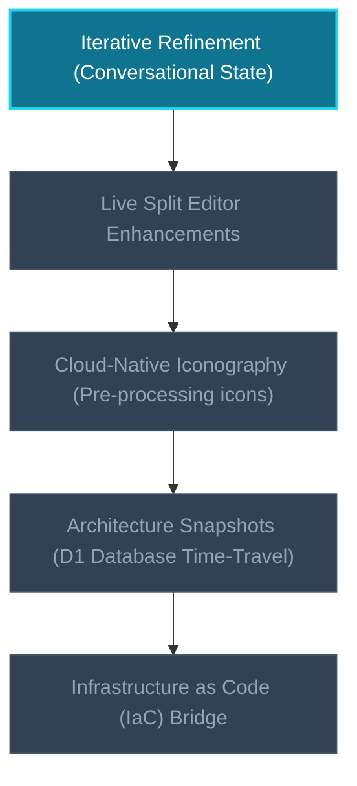

# Project Profile & Memory: way2go.cloud

This document serves as the permanent memory, architectural specification, and active roadmap tracking for **way2go.cloud**.

---

## 1. Project Core Identity
*   **App Name:** `way2go.cloud`
*   **Tagline/Purpose:** An enterprise-grade, plain-English-to-visual cloud architecture design tool. It translates architectural intentions into live Mermaid.js diagrams, simulates legacy-to-cloud migrations, and provides direct scaffolding to code.
*   **Target Audience:** Software developers, systems architects, and non-technical founders pitching infrastructure blueprints.

---

## 2. Tech Stack & Infrastructure Status
Below is the current active technology stack verified from the codebase structure:

| Layer | Technology / Implementation | Version / Package |
| :--- | :--- | :--- |
| **Frontend Framework** | React 19 (Single Page Application) | `react^19.2.6` |
| **Build System** | Vite 8 + TypeScript | `vite^8.0.12`, `typescript~6.0.2` |
| **Styling** | Tailwind CSS v4 | `tailwindcss^4.3.0`, `@tailwindcss/vite^4.3.0` |
| **Diagram Engine** | Mermaid.js (Client-side rendering) | `mermaid^11.15.0` |
| **State Compression** | Pako Gzip compression for URL-state sharing | `pako^2.1.0` |
| **Backend Compute** | Cloudflare Pages Functions | `@cloudflare/workers-types` |
| **AI Integration** | Cloudflare Workers AI (Llama 3.1) | `@cf/meta/llama-3.1-8b-instruct` |

---

## 3. Core Features Status
### 🟢 Implemented Features
- **Tactical Blueprint HUD:** Displays diagram direction (`SYS.DIR`), sync state (`SYNCING`, `FAULT`, `CONNECTED`), and the current SemVer build string.
*   **Command Deck Menu:** Features toggles for Mode (`STD` vs. `ARCH`), Drawer visibility, URL blueprint sharing (`Pako` compressed), workspace purging (`PURGE`), Dark/Light mode, Copy Code (`PASTE`), and Export SVG (`SVG`).
*   **Split-Drawer Code Editor:** A collapsible right drawer allowing power users to directly edit or paste raw Mermaid.js syntax with real-time sync (300ms debounce).
*   **Advanced Prompts & Sanitizers:** Dual system prompts (Standard vs. High-Level Simplifier) and an incremental update prompt (`UPDATE_SYSTEM_PROMPT`) to allow stateful surgical edits. Clean post-processing strips markdown fences, invalid trailing semicolons, and malformed edge syntax.
*   **Unified Assets Hosting:** Clean asset and serverless route orchestration configured via `wrangler.toml`.

---

## 4. Active Roadmap Features
The following features are prioritized for upcoming phases:

1.  **Iterative AI "Refinement" (Conversational State):** Move from single-update replacements to a full stateful modification chat loop, sending previous prompts or message histories to the Worker.
2.  **Live Mermaid Code Editor (Power User Mode):** Further refine the split-view layout so the left-hand text area and right-hand canvas have a smooth, error-resilient double-binding layout with an integrated syntax linter.
3.  **Cloud-Native Iconography Integration:** Integrate a pre-processing text mapping layer that translates terms like `[S3 Bucket]` or `[Edge Worker]` into specialized Mermaid classes or actual SVGs.
4.  **Architecture Snapshots ("Time Travel"):** Connect Cloudflare D1 to store version histories, enabling user branching, rollback capabilities, and visual diffs.
5.  **Infrastructure as Code (IaC) Bridge:** Map visual node graphs to corresponding Terraform (`.tf`) or CloudFormation boilerplate configuration scaffolding.

---

## 5. Operational Rules for CLI
- **SemVer Compliance:** Maintain standard SemVer values in `src/versionConfig.ts` (`1.1.0-dev` for local builds).
- **Safety Boundaries:** Always isolate Mermaid rendering inside an error boundary; never allow invalid syntax to freeze or crash the React app rendering engine.
- **Documentation Preservation:** Maintain strict documentation integrity in source headers.
